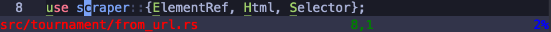

+++
title = "Rolling Your Own Neovim Statusline in Lua"
date = 2021-04-27
[taxonomies]
tags = ["neovim"]
+++

I've recently been rewriting my [neovim dotfiles](https://github.com/nihilistkitten/dotfiles/tree/main/nvim) in lua. One of the things I wanted to do was reduce my plugin dependencies{{ footnote(content="I only partially succeeded at this, unfortunately - I like cool toys too much.") }}, so rolling my own statusline seemed logical. I thought I'd write some quick documentation of my experience - most of this article is just a guided tour through the relevant help pages, but maybe it'll be helpful anyway.

<!-- more -->

Let's start by looking at what neovim gives us out of the box{{ footnote(content="Yes, I did choose a rust file ~~so I could pretend to be halfway competent~~ because that's *definitely* what I write most often.") }}:


This is the file path from vim's current working directory (`:h current-directory`), the current line and column number, and some information about how far we are through the file{{ footnote(content="In fact, it gives you a little more info not shown here - a little [+] will show up next to the filename once modified, for instance. But that's not super relevant to what we're doing, and I don't want to take a screenshot of every possible permutation of the statusline.") }}.

## Modifying the Statusline
Let's start with something basic: how do we change the statusline at all? For instance, let's say we want to write a static string.

Well, as always with (neo)vim, our first resource should be the help pages. `:h statusline` tells us that:

> When nonempty, this option determines the content of the status line.

Hm, ok, it seems like there's a statusline option{{ footnote(content="Vim options are a little outside the scope of this article, but there are great resources online, starting with the help page, `:h option`.") }} we can set. So I guess we can just do that:

```lua
vim.o.statusline = "Hello, world!"
```
And, indeed:


## Dynamic Content
So, statuslines aren't useful if they don't change. Let's read on in the help:

> The option consists of printf style '%' items interspersed with normal text.  Each status line item is of the form:
>
>   `%-0{minwid}.{maxwid}{item}`
>
> All fields except the {item} are optional.  A single percent sign can be given as "%%".

We can ignore most of these fields (for now) - they're described in more detail later in the help page, if you're interested. What's important for us is the list of items, which is right underneath. There's a lot, so I won't reproduce them here. Let's look at a few simple ones:


| item | help description                                                           |
| -----|----------------------------------------------------------------------------|
| f    | Path to the file in the buffer, as typed or relative to current directory. |
| m    | Modified flag, text is "[+]"; "[-]" if 'modifiable' is off.                |
| r    | Readonly flag, text is "[RO]".                                             |
| y    | Type of file in the buffer, e.g., "[vim]".  See 'filetype'.                |
| l    | Line number.                                                               |
| c    | Column number.                                                             |
| p    | Percentage through file in lines as in CTRL-G.                             |

Great, so we can now write a simple dynamic statusline:

```lua
vim.o.statusline = "%f | %l,%c | %p%%"
```


## Alignment
Ok, but, we're still not even better than the default statusline, which aligns the percentage number to the right, making better use of screen space. Again, the help comes to our rescue; it describes the `=` item as follows:

> Separation point between alignment sections. Each section will be separated by an equal number of spaces.

Let's try it:

```lua
vim.o.statusline = "%f %= %l,%c %= %p%%"
```

Great! We've created a rough (slightly less featureful) facsimile of the default statusline.


Now, in vimscript, you typically wouldn't write the whole statusline in one string like this. Instead, you'd do something like:
```vimscript
set statusline=
set statusline+=%f
set statusline+=%=
set statusline+=%l,%c
set statusline+=%=
set statusline+=%p%%
```

We can simply emulate this in lua:
```lua
local o = vim.o

o.statusline = ""
o.statusline = o.statusline .. "%f"
o.statusline = o.statusline .. "%="
o.statusline = o.statusline .. "%l,%c"
o.statusline = o.statusline .. "%="
o.statusline = o.statusline .. "%p%%"
```

This seems kind of janky because of the lack of a self-concatenation operator in lua, but it'll be useful when we want to add more complicated items to our statusline. If you prefer, you can write this:
```lua
vim.o.statusline = ""
                  .. "%f"
                  .. "%="
                  .. "%l,%c"
                  .. "%="
                  .. "%p%%"
```
This looks nice but is undone by luafmt, which wants to put all string concatenations on one line.

## Adding Color
Monochromatic statuslines are pretty boring. Fortunately, the help knows how to fix that:

> \# - Set highlight group. The name must follow and then a # again. Thus use %#HLname# for highlight group HLname. The same highlighting is used, also for the statusline of non-current windows.

And so{{ footnote(content="I'll skip the details of the `highlight` command; your colorscheme may define the necessary highlight groups, or you can try something like this. As far as I'm aware the lua highlighting apis aren't quite there yet, so I recommend sticking with `vim.cmd` for now. Also, keep in mind that depending on your terminal's color support you may need to use different options in place of `guifg` and `guibg`.") }}:

```lua
local o = vim.o
local cmd = vim.cmd

cmd "highlight StatusLeft guifg=red guibg=#32344a"
cmd "highlight StatusMid guifg=green guibg=#32344a"
cmd "highlight StatusRight guifg=blue guibg=#32344a"

o.statusline = ""
o.statusline = o.statusline .. "%#StatusLeft#"
o.statusline = o.statusline .. "%f"
o.statusline = o.statusline .. "%="
o.statusline = o.statusline .. "%#StatusMid#"
o.statusline = o.statusline .. "%l,%c"
o.statusline = o.statusline .. "%="
o.statusline = o.statusline .. "%#StatusRight#"
o.statusline = o.statusline .. "%p%%"
```


Finally, just to clean this up a little, we can write a `highlight` wrapper:

```lua
local o = vim.o
local cmd = vim.cmd

local function highlight(group, fg, bg)
    cmd("highlight " .. group .. " guifg=" .. fg .. " guibg=" .. bg)
end

highlight("StatusLeft", "red", "#32344a")
highlight("StatusMid", "green", "#32344a")
highlight("StatusRight", "blue", "#32344a")

o.statusline = ""
o.statusline = o.statusline .. "%#StatusLeft#"
o.statusline = o.statusline .. "%f"
o.statusline = o.statusline .. "%="
o.statusline = o.statusline .. "%#StatusMid#"
o.statusline = o.statusline .. "%l,%c"
o.statusline = o.statusline .. "%="
o.statusline = o.statusline .. "%#StatusRight#"
o.statusline = o.statusline .. "%p%%"
```

By the way, please don't seriously use the ugly built-in colors, they're just for demonstration.

## Lua Components
So far we've just translated from vimscript; let's very naively try to include some lua code in our statusline - you likely already see the error:

```lua
local fn = vim.fn
local o = vim.o
local cmd = vim.cmd

local function highlight(group, fg, bg)
    cmd("highlight " .. group .. " guifg=" .. fg .. " guibg=" .. bg)
end

highlight("StatusLeft", "red", "#32344a")
highlight("StatusMid", "green", "#32344a")
highlight("StatusRight", "blue", "#32344a")

function get_column_number()
    return fn.col(".")
end

o.statusline = ""
o.statusline = o.statusline .. "%#StatusLeft#"
o.statusline = o.statusline .. "%f"
o.statusline = o.statusline .. "%="
o.statusline = o.statusline .. "%#StatusMid#"
o.statusline = o.statusline .. "%l,"
o.statusline = o.statusline .. get_column_number()
o.statusline = o.statusline .. "%="
o.statusline = o.statusline .. "%#StatusRight#"
o.statusline = o.statusline .. "%p%%"
```

At first, it looks like this works - until we realize it always shows column 1:



This is because we're evaluating `fn.col` only once, at initialization. We need to dynamically evaluate our lua code every time the statusline is updated.

Well, the help page tells us how to do this in vimscript:

> When the option starts with "%!" then it is used as an expression, evaluated and the result is used as the option value.  Example:
>
> `:set statusline=%!MyStatusLine()`

Ok, so, our statusline has to start with `%!`, and then vim will evaluate it as an expression{{ footnote(content="See `:h luaeval()`, which is how you evaluate lua in an expression context.") }}:

```lua
local fn = vim.fn
local o = vim.o
local cmd = vim.cmd

local function highlight(group, fg, bg)
    cmd("highlight " .. group .. " guifg=" .. fg .. " guibg=" .. bg)
end

highlight("StatusLeft", "red", "#32344a")
highlight("StatusMid", "green", "#32344a")
highlight("StatusRight", "blue", "#32344a")

function get_column_number()
    return fn.col(".")
end

o.statusline = ""
o.statusline = o.statusline .. "%!"
o.statusline = o.statusline .. "%#StatusLeft#"
o.statusline = o.statusline .. "%f"
o.statusline = o.statusline .. "%="
o.statusline = o.statusline .. "%#StatusMid#"
o.statusline = o.statusline .. "%l,"
o.statusline = o.statusline .. "luaeval('get_column_number()')"
o.statusline = o.statusline .. "%="
o.statusline = o.statusline .. "%#StatusRight#"
o.statusline = o.statusline .. "%p%%"
```


(Sorry, mobile readers - not that any of these images have been great for you, but I'm sure this one is the worst of the bunch.)

Anyway, that error makes sense - it's trying to evaluate the whole string as an expression. One solution is suggested by the help:

> The result can contain %{} items that will be evaluated too.
>
> Note that the "%!" expression is evaluated in the context of the current window and buffer, while %{} items are evaluated in the context of the window that the statusline belongs to.

```lua
local fn = vim.fn
local o = vim.o
local cmd = vim.cmd

local function highlight(group, fg, bg)
    cmd("highlight " .. group .. " guifg=" .. fg .. " guibg=" .. bg)
end

highlight("StatusLeft", "red", "#32344a")
highlight("StatusMid", "green", "#32344a")
highlight("StatusRight", "blue", "#32344a")

function get_column_number()
    return fn.col(".")
end

o.statusline = ""
o.statusline = o.statusline .. "%#StatusLeft#"
o.statusline = o.statusline .. "%f"
o.statusline = o.statusline .. "%="
o.statusline = o.statusline .. "%#StatusMid#"
o.statusline = o.statusline .. "%l,"
o.statusline = o.statusline .. "%{luaeval('get_column_number()')}"
o.statusline = o.statusline .. "%="
o.statusline = o.statusline .. "%#StatusRight#"
o.statusline = o.statusline .. "%p%%"
```


And this works, but wrapping all our lua funtions as `%{luaeval('foo()')}` is going to get tiring and ugly fast. Here's what I propose{{ footnote(content="Shoutout to [this post](https://www.reddit.com/r/neovim/comments/kco3l3/help_lua_statusline_the_stubborn_way/) for inspiring this.") }}:

```lua
local fn = vim.fn
local o = vim.o
local cmd = vim.cmd

local function highlight(group, fg, bg)
    cmd("highlight " .. group .. " guifg=" .. fg .. " guibg=" .. bg)
end

highlight("StatusLeft", "red", "#32344a")
highlight("StatusMid", "green", "#32344a")
highlight("StatusRight", "blue", "#32344a")

local function get_column_number()
    return fn.col(".")
end

function status_line()
    local statusline = ""
    statusline = statusline .. "%#StatusLeft#"
    statusline = statusline .. "%f"
    statusline = statusline .. "%="
    statusline = statusline .. "%#StatusMid#"
    statusline = statusline .. "%l,"
    statusline = statusline .. get_column_number()
    statusline = statusline .. "%="
    statusline = statusline .. "%#StatusRight#"
    statusline = statusline .. "%p%%"

    return statusline
end

o.statusline = "%!luaeval('status_line()')"
```

And you can start using lua to your heart's desire! If there's interest, I can write a list of useful APIs; my [statusline](https://github.com/nihilistkitten/dotfiles/blob/main/nvim/lua/statusline.lua) uses `vim.bo.modified`, `vim.bo.readonly`, `vim.lsp.diagnostic.get_count`, `vim.fn.mode`, `vim.bo.filetype`, and `vim.b.gitsigns_status` from the [gitsigns](https://github.com/lewis6991/gitsigns.nvim) plugin.
